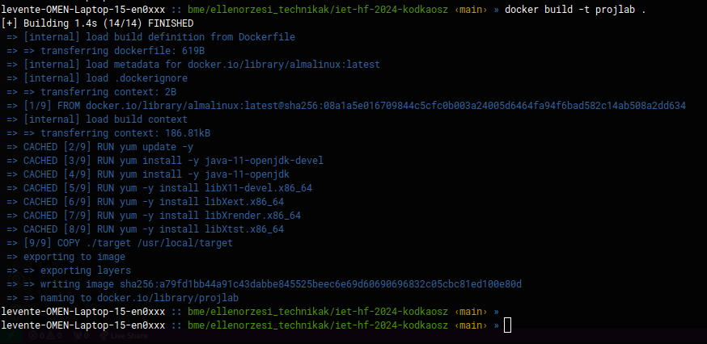
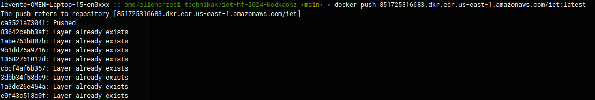
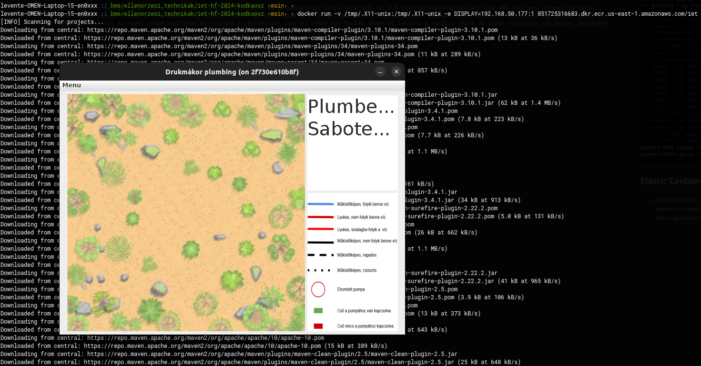

# Docker és Elastic Container Registry beüzemelése

## Docker

- Mivel a prototípus parancssorban fut, csak a grafikus változat containerization folyamatának volt értelme. Itt főképp a Dockerfile-t kellett szerkeszteni. Elsősorban a megfelelő kezdő image kiderítése volt fontos. Utána a Java Swing alkalmazáshoz szükséges package-ek összegyűjtése és telepítése kellett a konténerben. A hátralévő ```COPY ./target /usr/local/target``` és ```ENTRYPOINT ["java", "-jar", "/usr/local/target/hu.bme.projlab-0.5.0-SNAPSHOT.jar"]``` már a GUI-t indítja el.

- További fontos parancsok:
    - ```socat TCP-LISTEN:6001,reuseaddr,fork UNIX-CLIENT:/tmp/.X11-unix/X1```
    - ```docker build -t projlab .```
    - ```docker run -v /tmp/.X11-unix:/tmp/.X11-unix -e DISPLAY=<host ip addr here>:1 projlab```



## Elastic Container Registry (ECR)

- Az ECR egy AWS szolgáltatás amely a konténer image-ek tárolását és menedzselését teszi lehetővé. Az ECR konfigurálásához kellett egy AWS user egy account-on belül, melynek jogosultságai voltak az ECR repository modosításához. Az ECR repository létrehozása után a megfelelő push command-okkal lehetett feltölteni egy Docker image-et. Az ECR nyilvántartja az egyes image verziókat és szintén a létrehozott user-el lehet egy Docker image-et lehúzni a lokális gépre és futtattni egy Docker konténerben.





## Összefoglalás
Ebben a feladatban megismerkedtem a Docker-el és az AWS Elastic Container Registry szolgáltatásával. A Docker lehetőséget ad arra, hogy alkalmazásokat konténerben futtasuk. Az ECR szolgaltatás meg a Docker által létrehozott image-eket menedzseli. Az ECR hasznos amikor gyakran változik az alkalmazás kódja és mindig új image-et kell build-elni. Az image-ek verzióját nyilvántartja.