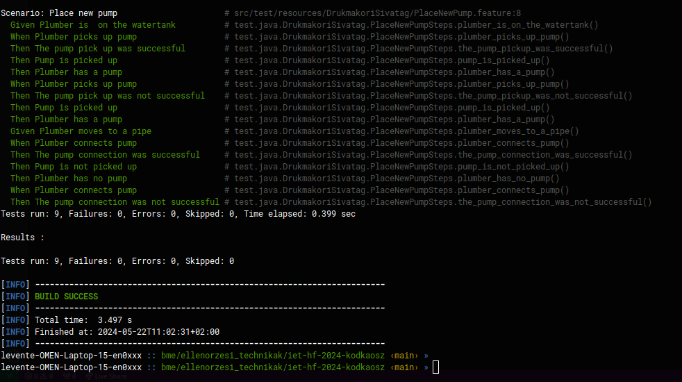
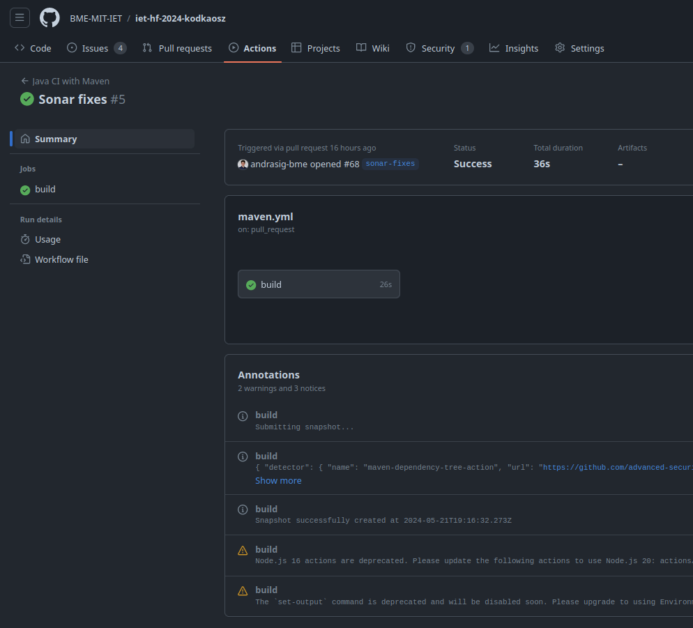

# Maven build keretrendszer és GitHub Actions CI beüzemelése

## Maven build keretrendszer

Ebben a feladatban egy pom.xml fájlt kellett létrhozni, illetve bekonfigurálni. A konfigurálás a plugin-ok és azok verzióját tartalmazta. Azt is be kellett állítani, hogy build-re milyen .java fájlokat kell figyelembe vegyen a maven. Fontos volt más feladatnál, hogy JAR fájlt is generáljon a maven minden build után. Ezért ezt a feature-t is megfelelően kellett konfigurálni. Mivel BDD teszteket is készítettunk, az is fontos volt, hogy a maven a teszteseteket is le tudja futtatni ```mvn test``` parancsra.



A képen látható a build, a JAR fájl létrehozása és a tesztek lefutása. Ezek után könnyen elindítható az alkalmazás ```java -cp ./target/hu.bme.projlab-0.5.0-SNAPSHOT.jar main.java.DrukmakoriSivatag.Main``` parancsra.

## GitHub Actions CI

A GitHub Actions konfigurációja egy maven.yml fájlban található. A YAML részletezi az érintett branch-eket, a JDK verziót, a lefuttattandó parancsot stb. Minden main-be való pull request esetén lefut a maven build és a build eredményet kiírja.



## Összefoglalás

Ebben a feladatban megismerkedtem a Maven build keretrendszerrel és a GitHub Actions CI rendszerrel. A maven build keretrendszer fontos az alkalmazás egyszerűbb build-eléséhez, illetve fontos a CI rendszer beüzemeléséhez. A GitHub Actions CI lehetőséget ad arra, hogy commit és pull request esetén az új kódot autómatikusan build-eljük.